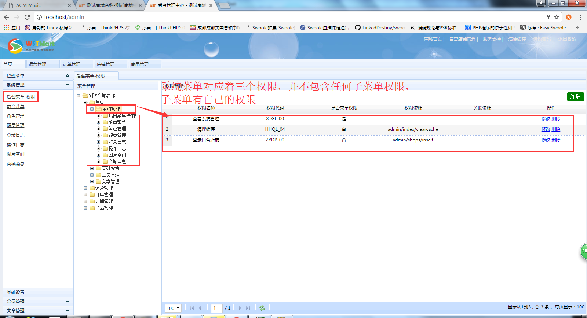
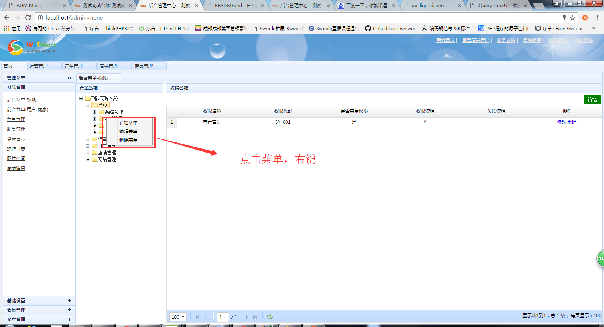

# 配置

坚定目标可以的


## thinkphp 内核修改

### 修改模型的select()只返回对象数组的不足
位置：thinkphp\library\think\db\Query.php


## nginx 配置
```
location / {
            
            index  index.html index.htm index.php l.php;
            
            if (!-e $request_filename) {
              rewrite  ^(.*)$  /index.php?s=/$1  last;
              break;
            }
            
            autoindex  off;
        }
```

## php 配置

1. 开启php_fileinfo.dll模块，打开php.ini文件，找到extension=php_fileinfo.dll，并打开

## 在断网情况下，访问页面可以通过报错查看时候有后门


# 前台

## HTML
## CSS

1. 位置：<http://localhost/home/carts/settlement.html>
问题：地址填写框大小不一致

2. 位置：商品详情页
问题：商品图片放大镜样式太烂

3. 位置：商品详情页
问题：商品属性和商品评价切换卡都没有，并且样式烂

## JS

## 功能问题

1. php版本只能5.5
3. 店铺装修后，没有预览功能，没有去前台看自己店铺的链接(可以点击进入卖家中心后的店铺图片去，但是这个应该设置个更加明确的链接)
4. 卖家中心-商品管理-新增商品-规格属性和商品相册功能有问题
解决：正常的，只是 商品信息-上传分类选择要先在后台配置 商品管理-商品规格中配置
5. 卖家中心没有权限管理（重要）
7. 买家评价后，无法追评(不急)
8. 判断是否有自动完成订单功能，如买家不确认收货
9. 添加子菜单，页面上没有体现关系(不急)
10. 后台快递管理太简单(添加打印的模板功能)，没有快递跟踪
11. 拒收的订单，退回后需要商家确认，就可以退回款项(包邮邮费商家出，普通寄送，即买家出了邮费
则买家出)
12. 清除缓存没作用(搞定)
13. 无论是商家还是系统后台，没有统计功能（重要）
14. home/view/default/base.html中的meta信息要改掉
15. common.js中有一个FI.getSysMessages()方法在轮询请求数据
16. 点击上传图片反应超级慢
17. 验证码图片太小
18. 投诉类型是写死的，最好一个表来维护
19. 订单状态隔10操作
20. 购买过程-支付方式直接显示在`home/carts/settlement.html`页面，不用单独显示支付方式
21. 卖家中心 - 商品管理 - 出售中的商品 - 规格属性的html中没有 商品规格、销售规格、商品属性时不显示
22. 控制器含多个单词，除首字母外的单词首字母都是小写的
23. 错误页面`/home/error/index.html`有样式问题
24. 前端的页面全部都是没有主题theme的，虽然tp5没有theme,但是有view_path可以充当，有空将模板页面整理一下
25. 买家退货、还需要运单号
26. 高德地图-信息窗体-带检索功能的信息窗体(安居乐是采用 高德地图-信息窗体-给多个点添加信息窗体 有可能是云图<http://lbs.amap.com/yuntu/reference/cloudstorage/>)
27. 

## 直接bug
bug1：
商家登陆后，可以删除其他商家的宝贝
位置：home/goods/del

备注：所有操作必许考虑是否本身就是该用户的，即增删改查的条件必许把用户id(有时是商家id)给带上

bug2：
商家登陆后，可以下架别人的商品
位置：home/goods/changeSale

bug3:
thinkphp5官方bug
位置：think\Model中的update()方法
修改：应该返回$result，而不是$model

bug4:
问题：店铺开通后，增加商品并没有限制商家增加经营范围外的商品
修改：暂时不弄

## 项目部分说明

### 表说明
```
/**
 * 商品属性说明：
 * 商品属性表fi_attributes、商品属性对应表fi_goods_attributes、商品表fi_goods、商品分类表fi_goods_cats
 * 1. 商品分类表与商品属性表形成一对多的关系，注意：goodsCatId字段是'最后一级商品分类ID'，即不可能再有子分类，如手机
 * 耳机等
 * 2. 商品属性表与商品表，通过商品属性对应表，形成多对多的关系。商品属性表中的attrVal，即属性值是提供给
 * 商品上传时选择的(当然有些也只提供输入框)。而具体商品的具体属性值是放在了商品属性对应表中的attrVal字段
 *
 * 商品规格说明：
 * 商品分类表fi_goods_cats、商品规格表fi_goods_specs、商品规格分类表fi_spec_cats、商品规格值表fi_spec_items、商品表fi_goods
 * 1. 商品分类表fi_goods_cats与商品规格分类表fi_spec_cats形成一对多的关系，注意：goodsCatId字段是'最后一级商品分类ID'，即不可能再有子分类，如手机
 * 耳机等
 * 2. 商品规格值表fi_spec_items与商品表fi_goods，通过 商品规格表fi_goods_specs建立多对多关系，不过该系统
 * 在 商品规格表fi_goods_specs表中直接用 specIds字段 来存储所有的 商品规格值表fi_spec_items的id，猜测：这样可以减少连接查询的表
 * 3. 商品规格分类表fi_spec_cats与商品规格值表fi_spec_items形成一对多关系
 *
 * 总结：其实商品分类表fi_goods_cats、商品表fi_goods是处于最中心的，前者关联商品属性名，规定属性值范围(即值填写和范围)，
 * 又关联规格名；后者则关联具体属性值、具体规格值
 * 
 * 
 */
```

### 后台菜单 - 权限说明
该系统有些特别(奇葩)，菜单是菜单，是父子孙无限级结构的，而权限本身是平级结构的，菜单与权限是一对多的关系。分别设置menus和privileges两张表





## 设计思路

### 关于用户地址

1. 第一次访问通过sina获取地址后，再查数据库，将id_地址存入session，同时将城市分割成名后
给前端显示(例如：1_北京，则显示'北京')

2. 用户觉得地址不对，则点击切换地址进行更改，更改采用lay弹窗，并且以发送请求方式(只需要传地址id)获取下一级
(暂时先这样，以后再优化)，在用户点击确认后，发送地址信息，并将session的地址进行更改

3. 搜索时候，一律采用session地址搜索

## 暂时工作笔记

地图需要的功能
1. 搜索页面可以直接跳转高德地图
2. 商品详情页展示店铺信息以及可以搜索路线(最好可以生成二维码)
3. 店铺首页展示店铺信息以及可以搜索路线(最好可以生成二维码)


OSS CDN
